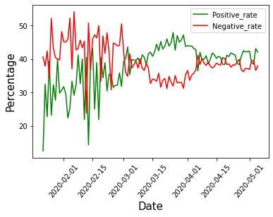
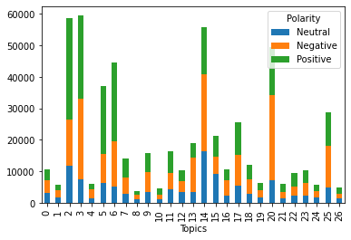

# Tweet_Analysis_COVID-19

## Fetching tweet

This is a modified version of getting past tweets from Jefferson Henrique (https://github.com/Jefferson-Henrique/GetOldTweets-python)

```
python3 GetOldTweets3.py
```

## Data Clean

We need to remove mention, website, non-ASCII, keywords before analysis

```
python3 dataClean.py
```

## Natural Language Processing

### Sentiment Analysis

Here I am using the nltk package to do the sentiment analysis



### LDA Topic Modelling

I am clustering the word into 27 topics. Topics are shown below:
| | Topic |
| ------------- | ------------- |
| 0 | hand, wash, tw, prisoner, clinical_trial, officer, writes, water, changing, soap |
| 1 | india, warned, trump, hart_island, oil, loved_one, latino, nyt, forever, changed |
| 2 | resource, join, pandemic, crisis, student, help, free, curve, webinar, health |
| 3 | like, people, know, shit, got, thing, going, gonna, day, think |
| 4 | dr_fauci, fauci, florida, texas, plasma, poverty, trump, saved, pollution, laid |
| 5 | stay, stayhome, home, nyc, safe, igshid, quarantine, time, socialdistancing, new |
| 6 | relief, worker, fund, help, pandemic, support, health, healthcare, donate, need |
| 7 | tiger, homeless, worker, essential, bronx_zoo, positive, test, mta, shelter, new |
| 8 | spain, grocery, initiative, threatens, hardest_hit, brief, pause, singapore, weekly, pledge |
| 9 | sign, petition, pandemic, trump, intelligence, month, spread, crisis, american_moneyforthepeople, projection |
| 10 | contact_tracing, mom, reopen, survivor, utm_source, minority, campaign, lost, project, shutdown |
| 11 | mask, face, wearing, wear, people, igshid, glove, like, articleshare, html_referringsource |
| 12 | testing, vaccine, trial, voting, site, launch, mail, vote, record, south_korea |
| 13 | black, people, rate, data, death, american, dying, higher, african, killing |
| 14 | case, death, new, york, death_toll, number, state, confirmed, city, total |
| 15 | update, live, briefing, mayor, blasio, latest, watch, news, new, task_force |
| 16 | prison, jail, inmate, passed_away, pandemic, release, charity, housing, rent, crisis |
| 17 | patient, drug, hydroxychloroquine, treatment, hospital, treat, doctor, supply, survey, study |
| 18 | tracking, privacy, apple_google, equipment, scam, google, technology, track, misinformation, news |
| 19 | cat, wisconsin, pet, dog, russia, easter_sunday, election, real_estate, animal, warns |
| 20 | trump, china, president, american, hoax, response, people, donald, biden, democrat |
| 21 | map, icu, amazon, feature, defeat, ea, challenging, bailout, democracy, cc |
| 22 | ventilator, frontline, fuck, sport, hero, peak, season, game, celebrity, fan |
| 23 | gate, inequality, nursing_home, pandemic, reveals, recovering, startup, crisis, utm_medium, success |
| 24 | passover, flight, airline, refund, tracker, cousin, payment, cancel, ease, pastor |
| 25 | test, recovered, flu, tested, antibody, people, symptom, immigrant, testing, know |
| 26 | easter, boris_johnson, honor, celebrate, navigate, veteran, church, chloroquine, tribute, magazine |

### Analysis

Combine the topics and sentiment results. 



The hot topics in tweet are topics 2, 3, 5, 6,14, 20.
